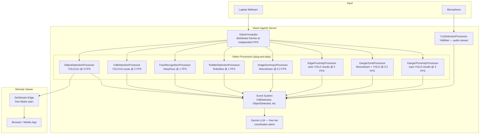

# Child Safety Monitoring — Vision Agents Video Processing Setup

Real-time child safety monitoring system using [Vision Agents](https://github.com/GetStream/vision-agents) with **all local ML models** on CPU + GetStream for remote streaming. **3-day hackathon timeline**.

---

## Architecture Overview



> [!IMPORTANT]
> **CPU Budget**: YOLO11n inference ≈ 50-100ms per frame on CPU. Running multiple processors at low FPS is feasible on a modern laptop. FPS values above are conservative — tune up if your CPU handles it.

---

## Feature → Processor Mapping

| # | Feature | Processor | ML Model | FPS | Priority |
|---|---------|-----------|----------|-----|----------|
| F3 | Object detection | `ObjectDetectionProcessor` | YOLO11n | 3 | 🔴 Day 1 |
| F7 | Fall detection | `FallDetectionProcessor` | YOLO11n-pose | 2 | 🔴 Day 1 |
| F5 | Remote streaming | GetStream Edge (built-in) | — | — | 🔴 Day 1 |
| F1 | Face recognition | `FaceRecognitionProcessor` | DeepFace | 1 | 🟡 Day 2 |
| F2 | Toddler recognition | `ToddlerDetectionProcessor` | Roboflow | 1 | 🟡 Day 2 |
| F4 | Image summary | `ImageSummaryProcessor` | Moondream | 0.2 | 🟡 Day 2 |
| F8 | Child near edge | `EdgeProximityProcessor` | YOLO + spatial | 2 | 🟢 Day 3 |
| F9 | Danger zone recognition | `DangerZoneProcessor` | Moondream + YOLO | 0.2 | 🟢 Day 3 |
| F10 | Danger object proximity | `DangerProximityProcessor` | YOLO + distance | 3 | 🟢 Day 3 |
| F6 | Cry detection | `CryDetectionProcessor` | YAMNet | audio | 🟢 Day 3 |

---

## Proposed Folder Structure

```
backend/
├── processors/                    # One file per feature — team members work independently
│   ├── __init__.py                # Exports all processor classes
│   ├── base.py                    # Shared utilities (draw bbox, distance calc, etc.)
│   ├── object_detection.py        # F3  — YOLO11n object detection (CORE)
│   ├── fall_detection.py          # F7  — YOLO11n-pose fall detection
│   ├── face_recognition.py        # F1  — DeepFace face recognition/entry
│   ├── toddler_detection.py       # F2  — Roboflow toddler classification
│   ├── image_summary.py           # F4  — Moondream scene description
│   ├── edge_proximity.py          # F8  — Child near edge/ledge detection
│   ├── danger_zone.py             # F9  — Auto danger zone mapping
│   ├── danger_proximity.py        # F10 — Dangerous object near child
│   └── cry_detection.py           # F6  — YAMNet audio cry detection
├── events/
│   ├── __init__.py
│   └── detection_events.py        # All custom Event dataclasses
├── tools/
│   ├── __init__.py
│   └── notify.py                  # LLM-callable alert/notification functions
├── models/                        # Downloaded model weights (gitignored)
│   └── .gitkeep
├── data/
│   ├── known_faces/               # Reference face images for F1
│   └── .gitkeep
├── server.py                      # Main agent — create_agent() + join_call() + Runner
├── pyproject.toml                 # uv project with vision-agents extras
├── .env.example                   # Required API keys template
└── README.md                      # Setup instructions for team
```

---

## Proposed Changes

### 1. Project Bootstrap

#### [NEW] [pyproject.toml](file:///home/krishna/Documents/Code/vision_hackathon/backend/pyproject.toml)

```toml
[project]
name = "vision-hackathon"
version = "0.1.0"
requires-python = ">=3.12"
dependencies = [
    "vision-agents[getstream,gemini,deepgram,elevenlabs,ultralytics,roboflow,moondream]",
    "python-dotenv",
    "opencv-python-headless",
    "deepface",
    "tensorflow",          # Required by YAMNet
]
```

#### [NEW] [.env.example](file:///home/krishna/Documents/Code/vision_hackathon/backend/.env.example)

```bash
# GetStream — free Maker plan: https://getstream.io/try-for-free/
STREAM_API_KEY=
STREAM_API_SECRET=

# Google AI Studio — free tier: https://aistudio.google.com/
GOOGLE_API_KEY=

# Deepgram — free $200 credit: https://deepgram.com/ (optional, for voice)
DEEPGRAM_API_KEY=

# ElevenLabs — free tier: https://elevenlabs.io/ (optional, for voice)
ELEVENLABS_API_KEY=

# Roboflow — free tier: https://roboflow.com/ (for toddler detection)
ROBOFLOW_API_KEY=
```

> [!NOTE]
> All services have **free tiers**. Deepgram + ElevenLabs are optional (only needed if you want voice interaction with the agent).

---

### 2. Custom Events

#### [NEW] [detection_events.py](file:///home/krishna/Documents/Code/vision_hackathon/backend/events/detection_events.py)

All processors emit events through Vision Agents' event system. Each event is a `@dataclass`:

| Event Class | Key Fields | Emitted By |
|---|---|---|
| `ObjectDetectedEvent` | `objects: list[dict]`, `frame_number` | ObjectDetection |
| `FallDetectedEvent` | `confidence: float`, `bbox: tuple` | FallDetection |
| `FaceRecognizedEvent` | `name: str`, `confidence: float` | FaceRecognition |
| `ToddlerDetectedEvent` | `confidence: float`, `bbox: tuple` | ToddlerDetection |
| `CryDetectedEvent` | `confidence: float`, `timestamp: float` | CryDetection |
| `EdgeProximityEvent` | `child_bbox`, `edge_location`, `distance_px` | EdgeProximity |
| `DangerZoneViolationEvent` | `zone_id: str`, `object_label: str` | DangerZone |
| `DangerObjectNearbyEvent` | `object_label`, `child_bbox`, `distance_px` | DangerProximity |

---

### 3. Video Processors (each file = 1 team member's responsibility)

Every processor extends `VideoProcessorPublisher` and follows this contract:

```python
class MyProcessor(VideoProcessorPublisher):
    name = "my_processor"
    
    async def process_video(self, track, participant_id, shared_forwarder):
        # Register frame handler on the VideoForwarder
    
    async def _process_frame(self, frame: av.VideoFrame):
        # Run ML inference, emit events, publish annotated frames
    
    def publish_video_track(self):
        # Return the QueuedVideoTrack with processed frames
    
    async def stop_processing(self):
        # Cleanup handlers
```

---

#### [NEW] [object_detection.py](file:///home/krishna/Documents/Code/vision_hackathon/backend/processors/object_detection.py) — **F3**

**Model**: YOLO11n (nano, ~6MB, CPU-friendly)

Core processor that many others depend on. Detects objects in each frame, draws bounding boxes, emits `ObjectDetectedEvent` with labels + bounding boxes. Publishes annotated video track.

Also stores latest detections in a **shared dict** (`self.latest_detections`) that other processors can reference to avoid running YOLO twice.

---

#### [NEW] [fall_detection.py](file:///home/krishna/Documents/Code/vision_hackathon/backend/processors/fall_detection.py) — **F7**

**Model**: YOLO11n-pose (keypoint estimation)

Detects falls by analyzing pose keypoints:
- Hip-to-shoulder vertical ratio (person horizontal = potential fall)
- Sudden change in center-of-mass Y position across frames
- Emits `FallDetectedEvent` when confidence threshold exceeded

---

#### [NEW] [face_recognition.py](file:///home/krishna/Documents/Code/vision_hackathon/backend/processors/face_recognition.py) — **F1**

**Model**: DeepFace (uses VGG-Face backend by default, CPU-compatible)

- Detects faces in frame
- Compares against reference images in `data/known_faces/`
- Emits `FaceRecognizedEvent` with matched name or "unknown"
- **Face entry**: New faces can be saved to `data/known_faces/{name}/` for future recognition

---

#### [NEW] [toddler_detection.py](file:///home/krishna/Documents/Code/vision_hackathon/backend/processors/toddler_detection.py) — **F2**

**Model**: Roboflow (Vision Agents plugin) — child/baby detection model from Roboflow Universe

- Uses a pre-trained model from Roboflow Universe for child detection (0-3 years)
- Falls back to YOLO person detection + aspect ratio heuristics (toddlers are shorter, different proportions) if Roboflow unavailable
- Emits `ToddlerDetectedEvent`

---

#### [NEW] [image_summary.py](file:///home/krishna/Documents/Code/vision_hackathon/backend/processors/image_summary.py) — **F4**

**Model**: Moondream (Vision Agents plugin, runs locally on CPU)

- Runs at very low FPS (every ~5 seconds) to save CPU
- After YOLO detections are available, sends the frame + detection context to Moondream
- Generates a natural language scene summary: "A toddler is playing near the kitchen table. A knife is on the counter."
- Emits `ImageSummaryEvent`

---

#### [NEW] [edge_proximity.py](file:///home/krishna/Documents/Code/vision_hackathon/backend/processors/edge_proximity.py) — **F8**

**Model**: YOLO (reuses detection results) + spatial analysis

- Detects children/persons near edges of elevated surfaces (tables, beds, stairs, balcony)
- Uses YOLO detections to find: (a) the child/toddler bbox, (b) furniture/surface bboxes
- Calculates pixel distance between child and edge-type objects
- Emits `EdgeProximityEvent` when child is within threshold distance

---

#### [NEW] [danger_zone.py](file:///home/krishna/Documents/Code/vision_hackathon/backend/processors/danger_zone.py) — **F9**

**Model**: Moondream + YOLO

**Two phases:**

1. **Initialization** (at program start): Capture a calibration frame, run Moondream to identify the scene layout and potential hazards (stairs, sharp furniture, kitchen area, balcony). Run YOLO to get precise object positions. Store these as danger zone polygons.

2. **Runtime**: Check each frame's person/toddler detections against the stored danger zones. Emit `DangerZoneViolationEvent` when a child enters a zone.

> [!NOTE]
> Full 3D mind-mapping is out of scope for 3 days. Instead, we use 2D spatial analysis on the camera's perspective — marking regions of the frame as dangerous based on what Moondream identifies in the initial scan.

---

#### [NEW] [danger_proximity.py](file:///home/krishna/Documents/Code/vision_hackathon/backend/processors/danger_proximity.py) — **F10**

**Model**: YOLO

- Maintains a list of dangerous object classes (knife, scissors, lighter, medication, small_parts, etc.)
- Detects when a dangerous object is within pixel-distance threshold of a detected child/person
- Emits `DangerObjectNearbyEvent`

---

#### [NEW] [cry_detection.py](file:///home/krishna/Documents/Code/vision_hackathon/backend/processors/cry_detection.py) — **F6**

**Model**: YAMNet (via TensorFlow, runs on CPU)

> [!IMPORTANT]
> This is an **audio** processor, not a video processor. It doesn't fit Vision Agents' `VideoProcessor` class directly. We'll implement it as a custom async task that listens to the audio stream and emits `CryDetectedEvent` through the agent's event system.

- Captures audio chunks from the call
- Runs YAMNet classification to detect crying/screaming sounds
- Emits `CryDetectedEvent` with confidence score

---

### 4. Shared Utilities

#### [NEW] [base.py](file:///home/krishna/Documents/Code/vision_hackathon/backend/processors/base.py)

Shared helpers for all processors:
- `draw_bbox(frame, bbox, label, color)` — draw annotated bounding boxes
- `calculate_distance(bbox1, bbox2)` — pixel distance between two detections
- `is_inside_zone(point, polygon)` — point-in-polygon check
- `format_detections(results)` — standardize YOLO output format

---

### 5. Tools (LLM-Callable)

#### [NEW] [notify.py](file:///home/krishna/Documents/Code/vision_hackathon/backend/tools/notify.py)

Functions the Gemini LLM can call to dispatch alerts:
- `send_alert(alert_type: str, message: str, severity: str)` — logs alert + could be extended to push notification / webhook

---

### 6. Main Server

#### [MODIFY] [server.py](file:///home/krishna/Documents/Code/vision_hackathon/backend/server.py)

Wires everything together:

```python
async def create_agent(**kwargs) -> Agent:
    return Agent(
        edge=getstream.Edge(),
        agent_user=User(name="Safety Monitor", id="agent"),
        instructions="You are a child safety monitoring AI. Alert on dangers...",
        llm=gemini.LLM("gemini-2.5-flash-lite"),  # Free tier text LLM
        processors=[
            ObjectDetectionProcessor(fps=3),
            FallDetectionProcessor(fps=2),
            FaceRecognitionProcessor(fps=1),
            ToddlerDetectionProcessor(fps=1),
            ImageSummaryProcessor(fps=0.2),
            # Day 3 processors added here as ready...
        ],
    )

async def join_call(agent, call_type, call_id, **kwargs):
    call = await agent.create_call(call_type, call_id)
    async with agent.join(call):
        await agent.simple_response("Safety monitoring active.")
        await agent.finish()

if __name__ == "__main__":
    Runner(AgentLauncher(create_agent=create_agent, join_call=join_call)).cli()
```

---

### 7. Cleanup

#### [DELETE] Empty placeholder directories (replaced by new structure)

`backend/ai_layer/`, `backend/auth/`, `backend/controller/`, `backend/routes/`, `backend/services/`, `backend/config/`

---

## 3-Day Timeline

### 🔴 Day 1 — Foundation + Core Detection
- Project setup (`pyproject.toml`, `uv sync`, `.env`)
- Folder structure + base utilities
- `ObjectDetectionProcessor` (YOLO11n) — powers multiple other features
- `FallDetectionProcessor` (YOLO11n-pose)
- `server.py` with GetStream — remote streaming works
- **Milestone**: Live camera feed with object detection + fall detection visible remotely

### 🟡 Day 2 — Identity + Understanding
- `FaceRecognitionProcessor` (DeepFace)
- `ToddlerDetectionProcessor` (Roboflow)
- `ImageSummaryProcessor` (Moondream)
- Event system wiring + notification tools
- **Milestone**: System recognizes faces, identifies toddlers, generates scene summaries

### 🟢 Day 3 — Safety Intelligence + Polish
- `EdgeProximityProcessor` — child near ledge/edge
- `DangerZoneProcessor` — auto zone mapping
- `DangerProximityProcessor` — dangerous object near child
- `CryDetectionProcessor` (YAMNet) — if time permits
- Demo prep, testing, README
- **Milestone**: Full safety monitoring with alerts

---

## Verification Plan

### Automated Tests
```bash
# 1. Dependencies install
cd backend && uv sync

# 2. Import smoke test
uv run python -c "from processors import ObjectDetectionProcessor, FallDetectionProcessor; print('OK')"

# 3. Server CLI check
uv run python server.py --help
```

### Manual Verification
1. Start server: `uv run python server.py serve`
2. Verify `/health` returns OK
3. Connect from browser via GetStream to see live annotated feed
4. Test each detection by performing actions in front of camera

---

## Services & Cost Summary

| Service | Purpose | Cost | Required? |
|---------|---------|------|-----------|
| GetStream | Remote video streaming | Free Maker plan | ✅ Yes |
| Google AI Studio (Gemini) | Text LLM for alerts | Free tier | ✅ Yes |
| Roboflow | Toddler detection model | Free tier (1K calls/mo) | ✅ Yes |
| Deepgram | Speech-to-text | Free $200 credit | ❌ Optional |
| ElevenLabs | Text-to-speech | Free tier | ❌ Optional |
| YOLO, DeepFace, Moondream, YAMNet | Local ML | Free (open source) | ✅ Yes |
