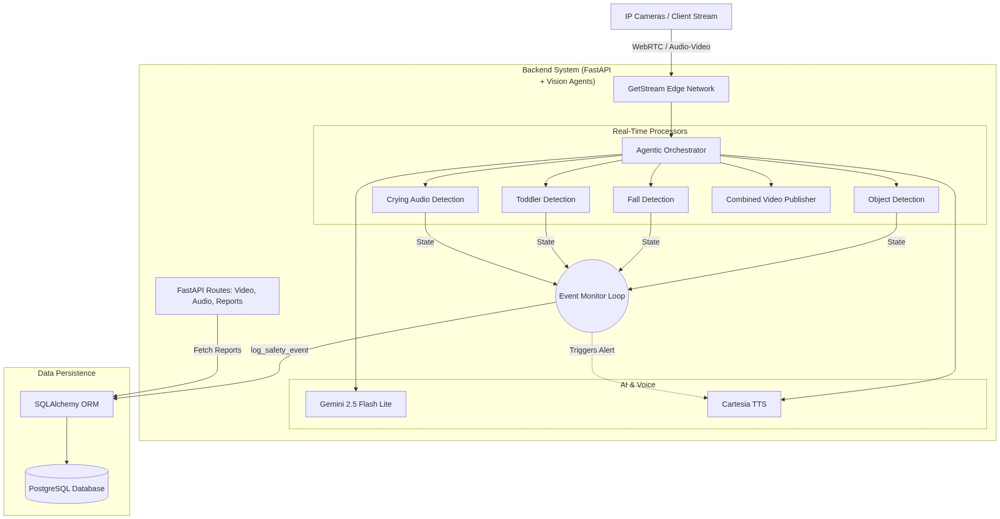

# Vision Hackathon Backend Architecture

This document outlines the architecture, data flow, and technology stack for the Vision Hackathon backend monitoring system.

## 🚀 Technology Stack

### Core Frameworks & Languages
* **Python 3.12+**: Core programming language.
* **FastAPI**: High-performance web framework for building APIs.
* **Uvicorn**: ASGI web server implementation for Python.

### AI & Computer Vision
* **Vision Agents**: SDK for building multimodal AI agents.
* **Gemini (gemini-2.5-flash-lite)**: Large Language Model for agent reasoning.
* **Cartesia**: Text-to-Speech (TTS) engine for voice alerts.
* **Roboflow**: Custom model inference (Toddler Detection).
* **Supervision**: Computer vision utilities for filtering and annotating detections.
* **Ultralytics (YOLO)**: Object and pose detection (e.g. `yolo11n.pt`, `yolo11n-pose.pt`).
* **OpenCV**: Video and image processing.

### Database & Storage
* **PostgreSQL**: Primary relational database.
* **SQLAlchemy (Async)**: Object-Relational Mapping (ORM).
* **Asyncpg**: Fast asynchronous PostgreSQL database client library for Python.

### Infrastructure & Streaming
* **GetStream**: Real-time video and audio edge network (WebRTC).
* **Docker / Docker Compose**: Containerization for the database and related services.
* **python-dotenv**: Environment variable management.

---

## 🏗️ System Architecture Flow Chart

The system is built around a central **Vision Agent** that connects to video/audio streams and orchestrates various real-time processors. The agent leverages Gemini for intelligent reasoning and logs safety events to a PostgreSQL database.

## 🧩 Key Components

1. **Agent (`server.py`)**: 
   The main runner configures the agent with instructions, LLM (Gemini), TTS (Cartesia), and multiple perception processors. It connects to GetStream for handling live calls.
   
2. **Processors (`processors/`)**:
   * `ObjectDetectionProcessor`: Detects general objects in the video frame.
   * `FallDetectionProcessor`: Uses pose estimation to detect if a person has fallen.
   * `ToddlerProcessor`: Uses a custom Roboflow model to specifically identify toddlers in the scene.
   * `CryingAudioDetector`: Analyzes the audio stream for baby crying sounds.
   * `CombinedVideoPublisher`: Aggregates the visual output of the processors for external viewing.

3. **Event Monitoring Loop**:
   Inside the `join_call` function, an asynchronous loop runs every 0.5 seconds to poll the state of all processors. If a danger (like a fall or crying) is detected, it triggers a voice response (via TTS) and logs the event to the database.

4. **FastAPI Routes (`routes/`)**:
   * Exposes endpoints for video and audio management.
   * Exposes `/reports` routes for querying the logged safety events from the database.
